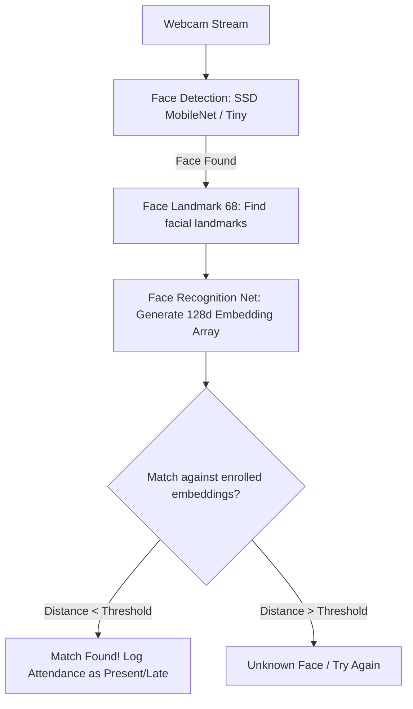

# ParaScan: Face Recognition Attendance System

ParaScan is a modern, privacy-focused, client-side Face Recognition Attendance System. It uses advanced deep learning models directly in the web browser to detect faces, extract 128-dimensional facial embedding vectors, and match them against a local database to log attendance in real time. 

Built using pure frontend technologies (HTML5, Vanilla CSS, and JavaScript) along with a lightweight Node.js helper server, ParaScan runs entirely on your device with no external APIs, cloud dependencies, or database installations.

---

## 🚀 Key Features

*   **Real-Time Face Detection & Recognition**: Leverages a maintained web-friendly TensorFlow.js-based fork (`@vladmandic/face-api`) to run facial recognition directly in the browser.
*   **Intuitive Admin Dashboard**: Live trackers showing total enrolled members, today's attendance stats (Present, Late, Absent), and system health metrics.
*   **Easy Member Enrollment**: Register members instantly by taking a snapshot, generating their face embeddings, and assigning a name and role (e.g., Employee, Student, Admin).
*   **Customizable Settings & Calibration**:
    *   **Detection Model**: Switch between **SSD MobileNet V1** (higher accuracy) and **Tiny Face Detector** (higher performance).
    *   **Strictness (Threshold)**: Adjust the similarity threshold slider to control matching sensitivity (lower = stricter).
    *   **Work Shift Rules**: Set a custom shift start time and late grace period (in minutes) to automatically mark users as "Present" or "Late".
    *   **Scan Cooldown**: Set a restriction timer to prevent duplicate attendance logs for the same person within a short period.
*   **Premium Glassmorphic UI**: Fully responsive sidebar layout with full support for light and dark theme toggles.
*   **Synthesized Audio Feedback**: Zero-dependency audio chime generator using the browser's Web Audio API for success and failure notifications.
*   **Local Privacy-First Storage**: All employee details, facial embeddings (128-float arrays), and attendance logs are saved locally in the browser's `localStorage`. No face images are stored.
*   **Data Export**: Export logs as a structured CSV/JSON file directly from the dashboard.

---

## 🛠️ Tech Stack

*   **Core**: HTML5, Vanilla JavaScript (ES6+), CSS3 Variables.
*   **AI Engine**: [face-api.js](https://github.com/vladmandic/face-api) (TensorFlow.js backend) loaded via CDN.
*   **Local Server**: Node.js (native `http` and `fs` modules, zero npm dependencies).
*   **Database**: Browser `localStorage` (Stores serialized 128-dimensional floating-point descriptors).

---

## 📂 Project Directory Structure

```text
face-attendance-system/
├── models/                      # Pre-trained face-api.js weights & manifests
│   ├── ssd_mobilenetv1_model-weights_manifest.json
│   ├── ssd_mobilenetv1_model-shard1
│   ├── face_landmark_68_model-weights_manifest.json
│   ├── face_recognition_model-weights_manifest.json
│   └── ...
├── app.js                       # Frontend logic, face-api pipeline, and DB operations
├── index.html                   # Dashboard UI structure & Navigation
├── styles.css                   # Glassmorphism, animations, layouts, and variables
├── server.js                    # Zero-dependency local Node.js static server
├── download_models.py           # Helper Python script to download models if missing
└── README.md                    # Project documentation
```

---

## ⚡ Getting Started

### Prerequisites

*   **Node.js** (v14 or higher recommended) installed on your system.
*   A webcam connected to your computer.

### Installation & Launch

1.  **Clone the repository:**
    ```bash
    git clone https://github.com/parasyadav-sw/Attendance-Management-System-Using-Face-Recognition.git
    cd Attendance-Management-System-Using-Face-Recognition
    ```

2.  **Start the Local Server:**
    Run the native Node.js server to serve the project files:
    ```bash
    node server.js
    ```
    *Note: No `npm install` is required as `server.js` uses standard Node built-in packages!*

3.  **Access the Application:**
    Open your web browser (Chrome, Edge, or Firefox recommended) and navigate to:
    **[http://localhost:3000](http://localhost:3000)**

---

## 🔍 How It Works

ParaScan processes your video feed locally inside the browser. The underlying architecture operates as follows:



1.  **Detection**: The web camera captures frames, and the face detector finds bounding boxes around faces.
2.  **Alignment**: 68 facial landmark coordinates are located, aligning the eyes, nose, and mouth to normalize rotation and tilt.
3.  **Encoding**: The face recognition model extracts a **128-dimensional floating-point array** representing the face's distinct features.
4.  **Matching**: The browser computes the **Euclidean Distance** between the scanned face and all registered face descriptors in `localStorage`. 
    *   If the distance is below the threshold slider value (default `0.50`), a match is confirmed and attendance is logged.
    *   If no match is close enough, it remains marked as "Unknown".

---

## ⚙️ Configuration & Tuning

Under the **Settings** tab, you can customize the system's behavior:

| Setting | Default | Description |
| :--- | :--- | :--- |
| **Detection Model** | SSD MobileNet V1 | SSD is more accurate; Tiny Face Detector is faster and uses fewer CPU resources (ideal for low-end hardware). |
| **Match Threshold** | 0.50 | Controls strictness. Lower numbers (e.g., 0.40) require a closer match, preventing false positives but making recognition stricter. |
| **Attendance Cooldown** | 5 minutes | Prevents a person from scanning multiple logs consecutively. |
| **Shift Start Time** | 09:00 | Attendance marked after this time + grace period will be flagged as "Late" in dashboard logs. |
| **Grace Period** | 15 minutes | Late leeway duration. |

---

## 🔒 Security & Camera Permissions

*   **Camera Permission**: Modern browsers restrict webcam access to "Secure Contexts". The app must be served via `http://localhost` or `https://`. Double-clicking the `index.html` file (using the `file://` protocol) will block webcam access.
*   **Privacy Statement**: All face detection and recognition calculations happen **completely in the user's browser**. No biometric data, video feeds, or photos are uploaded to any server.

---

## 📄 License

This project is open-source and available under the MIT License.
